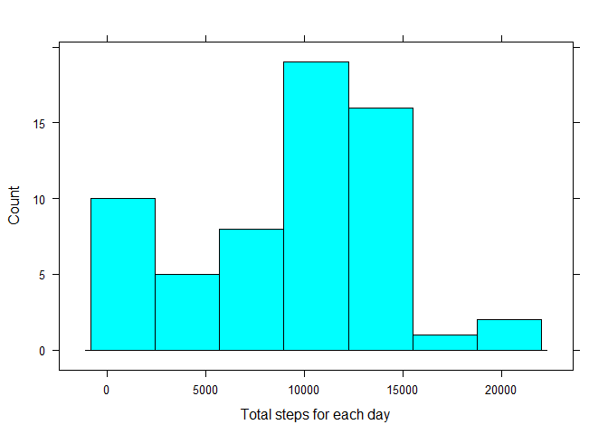

# Reproducible Research: Peer Assessment 1

## Loading and preprocessing the data

Setting working directory and loading the required libraries.


```r
setwd("C:/Data Scientific/Reproducible Research/RepData_PeerAssessment1")
library("data.table")
library("lattice")
```

Reading the .csv using in this research.


```r
dt <- read.csv("activity.csv")
```

## What is mean total number of steps taken per day?

Code to calculate the total number of steps for each day.


```r
#this function give the sum of each interval in one day
totalPerDay <- function(date)
{
  sum(dt$steps[dt$date == date], na.rm = TRUE)
}
#using a sapply to generate the total of steps for each day
means <-  data.table(date=as.POSIXct(unique(dt$date)),"stepsMean"=sapply(unique(dt$date),totalPerDay))
```

Histogram with the mean steps taken each day.

 


The median of steps for eachs day is 10395.
The average of steps is 9354.2295082.

## What is the average daily activity pattern?


This code chunk calculate the average of the same interval over all the days.


```r
totalPerInterval <- function(interval)
{
  mean(dt$steps[dt$interval == interval], na.rm = TRUE)
}
activity <-  data.table(interval=unique(dt$interval),"stepsMean"=sapply(unique(dt$interval),totalPerInterval))
```

Time-series plot with the average activity pattern 

 


The interval with the average maximun number of steps  is the interval number 835 with  206.1698113 steps

## Imputing missing values

Number total of values with NA using is.na.data.frame


```r
numberOfNAS <- is.na.data.frame(dt)
sum(numberOfNAS)
```

```
## [1] 2304
```

Strategy for filling the missing values of the dataset:

- Replace the missing values with the average of steps per day between the number of intervals

Create a new dataset called newDt with the NAS filled.

```r
value_to_fill <- showMean / length(unique(dt$interval))
newDt <- dt
newDt$steps[is.na(newDt$steps)] <- value_to_fill 
```

Check again the amount of NAS.

```r
numberOfNAS <- is.na.data.frame(newDt)
sum(numberOfNAS)
```

```
## [1] 0
```

Code to calculate the total number of steps for each day.


```r
#this function give the sum of each interval in one day
totalPerDay2 <- function(date)
{
  sum(newDt$steps[newDt$date == date], na.rm = TRUE)
}
#using a sapply to generate the total of steps for each day
meansNew <-  data.table(date=as.POSIXct(unique(newDt$date)),"stepsMean"=sapply(unique(newDt$date),totalPerDay2))
```

Histogram with the mean steps taken each day without NAs.

 


The median of steps for eachs day is now 1.0395\times 10^{4} with NAs is 10395.
The average of steps is now 1.0581014\times 10^{4} with Nas is 9354.2295082.

We can observe the median still being the same and the average is raised.

## Are there differences in activity patterns between weekdays and weekends?

With the new dataset we added the kindOfDay factor value.

This code chunk added a factor of 'weekend' or 'weekday' in a field called kindOfDay.


```r
fillKindOfDay <- function(dateIn)
{
    day = weekdays(as.POSIXct(dateIn))
    if (day == "lunes" || day == "martes" || day == "miércoles" || day == "jueves" || day == "viernes")
    {
      return("weekday")
    }
    else if (day == "Monday" || day == "Tuesday" || day == "Wednesday" || day == "Thursday" || day == "Friday")
    {
      return("weekday")
    }
    else if (day == "sábado" || day == "domingo")
    {
      return("weekend")
    }
    else if (day == "Saturday" || day == "Sunday")
    {
      return("weekend")
    }
    else
    {
      return(NA)   
    }    
}
newDt$kindOfDay <-  sapply(newDt$date,fillKindOfDay)
head(newDt)
```

```
##      steps       date interval kindOfDay
## 1 32.47996 2012-10-01        0   weekday
## 2 32.47996 2012-10-01        5   weekday
## 3 32.47996 2012-10-01       10   weekday
## 4 32.47996 2012-10-01       15   weekday
## 5 32.47996 2012-10-01       20   weekday
## 6 32.47996 2012-10-01       25   weekday
```


Plot with the average activity patterns.

  
